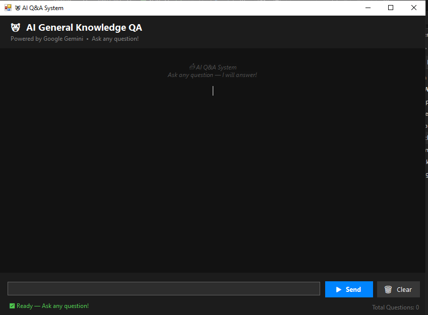
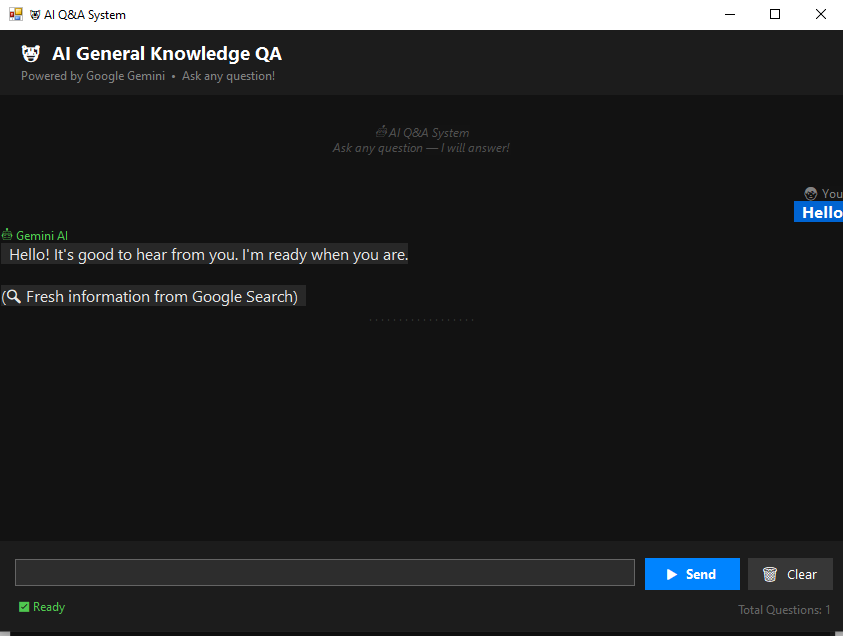
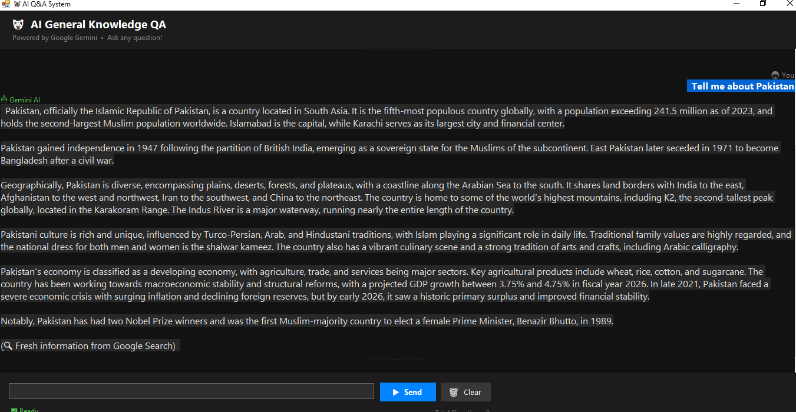

# AIQnA
# 🤖 AI General Knowledge Q&A – Gemini Chatbot

A modern Windows Forms desktop application that uses **Google Gemini 2.5 Flash** to answer any question.  
The chatbot remembers conversation history (including your name) and can fetch **real‑time information** via Google Search grounding.


---

##  Features

-  **Full conversation memory** – remembers your name, previous questions, and context.
- **Google Search grounding** – gives current answers (president, news, sports scores, etc.) when needed.
-  **Modern dark UI** – chat bubbles, smooth design, responsive layout.
-  **Keyboard shortcuts** – press `Enter` to send, `Ctrl+Enter` for new line.
- **Clear history** – reset conversation memory with a confirmation dialog.
-  **Fast & free** – uses Gemini free tier (60 requests/minute).

---

##  Getting Started

### Prerequisites

- **Windows OS** (7, 8, 10, 11)
- **.NET Framework 4.7.2** or higher (or .NET Core 3.1 / .NET 5+)
- **Google Gemini API key** – get one from [Google AI Studio](https://makersuite.google.com/app/apikey)

## 🛠️ Technologies Used

| Technology | Details |
|---|---|
| Language | C# 8.0 |
| Framework | .NET 6.0 |
| UI | Windows Forms (WinForms) |
| AI Model | Google Gemini 1.5 Flash |
| HTTP Client | System.Net.Http |
| JSON Parsing | System.Text.Json |
| Containerization | Docker |

---

## Project Structure
```
AIQnA/
├── Form1.cs              # Main logic & AI API calls
├── Form1.Designer.cs     # UI layout & controls
├── Program.cs            # Entry point
├── AIQnA.csproj          # Project config
├── Dockerfile            # Docker setup
├── .gitignore            # Hides API key & build files
└── README.md             # This file
```
##  Setup Instructions

### Step 1 — Prerequisites
Make sure you have the following installed:
- [Visual Studio 2022](https://visualstudio.microsoft.com/) with **.NET Desktop Development** workload
- [.NET 6.0 SDK](https://dotnet.microsoft.com/download/dotnet/6.0)
- A free Google AI API key from [aistudio.google.com](https://aistudio.google.com)

### Step 2 — Clone the Repository
```
git clone https://github.com/Aleeza-Maryam/AIQnA.git
cd AIQnA
```

### Step 3 — Add Your API Key
Open `Form1.cs` and replace the API key:
```csharp
private const string API_KEY = "YOUR_GOOGLE_API_KEY_HERE";
```

### Step 4 — Run the Project
1. Open `AIQnA.sln` in Visual Studio 2022
2. Press **F5** to build and run
3. Type any question in the input box
4. Press **Enter** or click **Send**

### Step 5 — Docker (Optional)
Build and run using Docker:
```
docker build -t aiqna-app .
docker run --isolation=process aiqna-app
```
> Note: Requires Docker Desktop in Windows container mode.
## 📸 Screenshots

### Chat Interface


### AI Response

### AI Response

